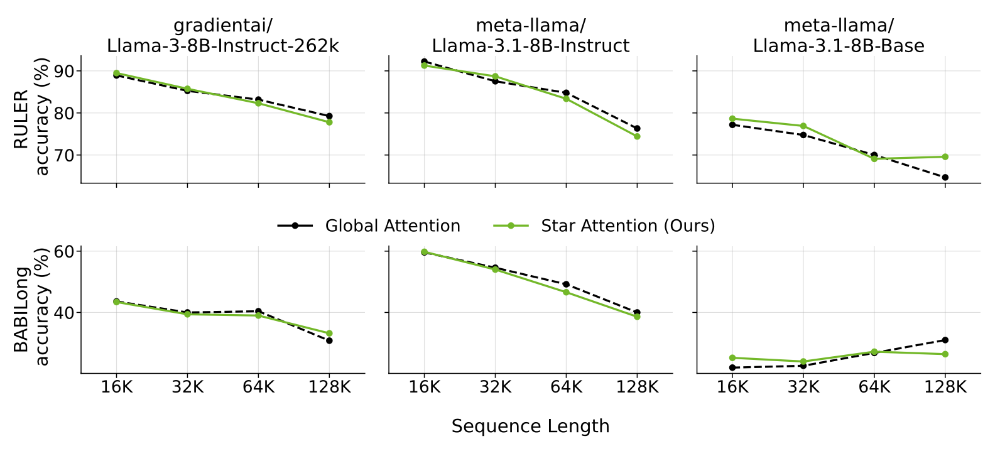
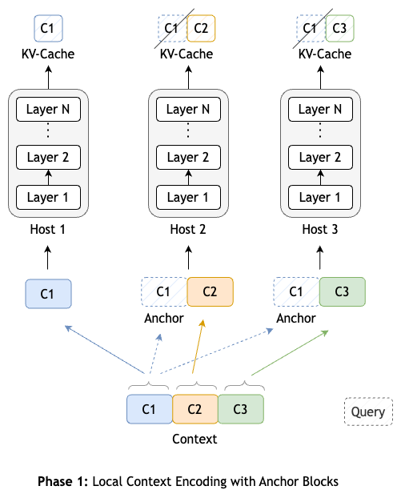
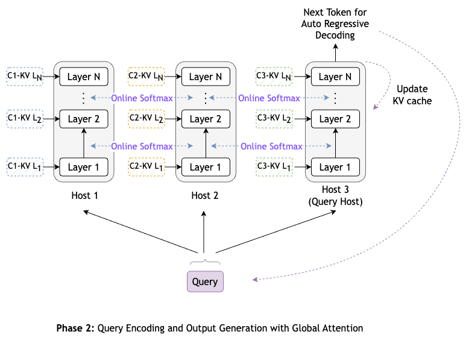

# Star Attention: Efficient LLM Inference over Long Sequences

This repository contains code for the paper [Star Attention: Efficient LLM Inference over Long Sequences](https://arxiv.org/abs/2411.17116). Star Attention is a novel block-sparse attention mechanism designed to enable efficient inference on long sequences in transformer-based LLMs. The method operates in two phases:
1. **Phase 1 - Context Encoding**: The context tokens are processed using blockwise-local attention, with the context segmented into blocks where each block is prefixed with an anchor block.
2. **Phase 2 - Query Processing and Token Generation**: The query and response tokens attend to all prior cached tokens through sequence-global attention.

Star Attention **improves the inference time by up to 11x** while **preserving 95-100% of accuracy**. The method is **compatible with most Transformer-based LLMs trained with global attention, operating seamlessly out-of-the-box without additional training/finetuning.** Furthermore, Star Attention is **orthogonal to other optimization methods**, including Flash Attention and KV cache compression techniques, allowing for potential combined enhancements.

This codebase contains the implementation of Star Attention in PyTorch using the [HuggingFace Transformers](https://github.com/huggingface/transformers) library, along with the code for launching inference with Star Attention on two benchmarks: RULER and BABILong.

<div align="center">
  <table>
      <thead>
          <tr>
              <th rowspan="2" style="text-align: center">Model</th>
              <th rowspan="2" style="text-align: center">Seq. Len.<br>(K)</th>
              <th rowspan="2" style="text-align: center">Block Size<br>(K)</th>
              <th rowspan="2" style="text-align: center">Ring-Attn<br>Acc. (%)</th>
              <th colspan="2" style="text-align: center">Star-Attn</th>
          </tr>
          <tr>
              <th style="text-align: center">Δ Acc.</th>
              <th style="text-align: center">Δ Speedup</th>
          </tr>
      </thead>
      <tbody>
          <tr>
              <td rowspan="4">gradientai<br>Llama3-8B-Instruct-1048K</td>
              <td style="text-align: center">16</td>
              <td style="text-align: center">4</td>
              <td style="text-align: center">86.12</td>
              <td style="text-align: center">+2.47%</td>
              <td style="text-align: center">1.1x</td>
          </tr>
          <tr>
              <td style="text-align: center">32</td>
              <td style="text-align: center">8</td>
              <td style="text-align: center">82.52</td>
              <td style="text-align: center">+1.54%</td>
              <td style="text-align: center">1.2x</td>
          </tr>
          <tr>
              <td style="text-align: center">64</td>
              <td style="text-align: center">16</td>
              <td style="text-align: center">79.05</td>
              <td style="text-align: center">+1.28%</td>
              <td style="text-align: center">1.8x</td>
          </tr>
          <tr>
              <td style="text-align: center">128</td>
              <td style="text-align: center">32</td>
              <td style="text-align: center">77.39</td>
              <td style="text-align: center">+1.23%</td>
              <td style="text-align: center">2.7x</td>
          </tr>
          <tr>
              <td rowspan="3">meta-llama<br>Llama-3.1-70B-Instruct</td>
              <td style="text-align: center">16</td>
              <td style="text-align: center">4</td>
              <td style="text-align: center">95.09</td>
              <td style="text-align: center">-2.85%</td>
              <td style="text-align: center">1.7x</td>
          </tr>
          <tr>
              <td style="text-align: center">32</td>
              <td style="text-align: center">8</td>
              <td style="text-align: center">94.61</td>
              <td style="text-align: center">-2.70%</td>
              <td style="text-align: center">2.0x</td>
          </tr>
          <tr>
              <td style="text-align: center">64</td>
              <td style="text-align: center">16</td>
              <td style="text-align: center">88.54</td>
              <td style="text-align: center">-1.63%</td>
              <td style="text-align: center">4.7x</td>
          </tr>
      </tbody>
  </table>
  <p align="justify">
    <b>Table 1:</b> Star Attention vs Ring Attention (baseline) accuracy and relative inference speed-up. The Δ for Star Attention shows the relative accuracy improvement (+) or degradation (-). We set block size to one-quarter of the sequence length.  Star Attention achieves significant speedup over Ring Attention while maintaining the accuracy. For larger models, the speedup of Star Attention is even more pronounced.
  </p>
</div>
<br>
<div align="center">
  
  <p align="justify">
    <b>Figure 1:</b> Accuracy (%) of Star Attention on RULER and BABILong evaluated on sequence lengths of 16K, 32K, 64K, and 128K. In all experiments, the block size and anchor block size are set to one-quarter of the total sequence length. Results using the Llama-3-8B-Instruct-262k, Llama-3.1-8B-Instruct and Llama-3.1-8B-Base models demonstrate that Star Attention retains 95-100% of the accuracy of global attention, and in some cases, even outperform it.
  </p>
</div>

## Table of Contents
1. [Setup Instructions](#setup-instructions)
   - [Dependencies](#dependencies)
   - [RULER Setup](#ruler-setup)
   - [Downloading Models](#downloading-models)
2. [Launching Inference with Star Attention](#launching-inference-with-star-attention)
   - [RULER](#ruler)
   - [BABILong](#babilong)
   - [Running Inference on Custom Data](#running-inference-on-custom-data)
3. [Two Phases of Star Attention](#two-phases-of-star-attention)
   - [Phase 1 - Context Encoding](#phase-1---context-encoding)
   - [Phase 2 - Query Processing and Token Generation](#phase-2---query-processing-and-token-generation)
4. [Citation](#citation)
5. [References](#references)
6. [Contact/Getting Help](#contactgetting-help)


## Setup Instructions

### Dependencies

Install all the project dependencies with
```
$ pip install -r requirements.txt
```

In a python shell, download the `punkt` tokenizer from the `nltk` library:
```
import nltk
nltk.download('punkt_tab')
```

### RULER Setup

To generate synthetic data for RULER, you need to download:
- Paul Graham Essays for NIAH from [NIAH Github](https://github.com/gkamradt/LLMTest_NeedleInAHaystack/tree/main/needlehaystack/PaulGrahamEssays) and [Paul Graham Blog](https://paulgraham.com/articles.html).
- QA datasets from [SQuAD](https://rajpurkar.github.io/SQuAD-explorer/) and [HotpotQA](https://hotpotqa.github.io/).

To download these data, run:
```
$ bash ruler/download_data.sh
```

### Downloading Models

To download a model from HuggingFace, use the script: [`scripts/download_hf_model.py`](scripts/download_hf_model.py).

*NOTE: For certain models, you might need to input the huggingface hub token from your account settings via the `--token` flag.*

## Launching Inference with Star Attention

This repository contains code for launching inference with Star Attention on two benchmarks: RULER and BABILong. The instructions to run each of those benchmarks are shared in the following subsections.

### RULER
[ [Paper](https://arxiv.org/abs/2404.06654) | [GitHub](https://github.com/hsiehjackson/RULER) ]

To run inference on RULER, use the script: [`run_ruler.py`](run_ruler.py).

Usage:
```
$ python run_ruler.py \
    -n <experiment_name> \
    -p <path_to_model> \
    -pc <prompt_template_type> \
    -a star \
    -bs <context_block_size> \
    -l <list_of_sequence_lengths_to_run_inference> \
    -np <num_parallel_processes_per_node> \
    --output_dir <output_directory>
```

After running the evaluations, you can display all the results together using the script:
```
$ python ruler/gather_results_ruler.py \
    -e <path_to_results_directory>
```

#### Configuring the `-np` flag

The `-np` flag specifies the number of parallel processes (hosts) to use for running inference. For example, if your machine has 8 GPUs:
- `-np 8`: Launch 8 hosts, each host assigned a single GPU.
- `-np 4`: Launch 4 hosts, each host assigned 2 GPUs.

This is useful when you want to run star attention with bigger context block sizes or with bigger models where assigning a single GPU per host leads to out-of-memory errors.

To see an example of how to run this script with different configurations, check [`launch.sh`](launch.sh).

#### Configuring the `-nn` flag for Multi-Node Inference

If you have a multi-node setup (such as a slurm cluster), then you can add the `-nn <num_nodes>` for running multi-node inference. The script will launch a total of `nn * np` processes (hosts) for inference.

For example, in a system with 8 GPUs on each node, if `-nn 1` and `-np 4` are specified, the script will launch 4 processes (hosts) on a single node. This means that each host is allocated 2 GPUs to load the model. If the model or the block size is too large, you can scale the `nn` and the `np` parameters accordingly. If `-nn 2` and `-np 2`, then the script will launch a total of 4 processes (hosts) across 2 nodes, with each host containing 4 GPUs.

### BABILong
[ [Paper](https://arxiv.org/abs/2406.10149) | [GitHub](https://github.com/booydar/babilong) ]

To run inference on BABILong, use the script: [`run_babilong.py`](run_babilong.py).

The script takes in the same set of arguments as the RULER script described above. To see an example of how to run this script with different configurations, check [`launch.sh`](launch.sh).

After running the evaluations, you can display all the results together using the script:
```
$ python babilong/gather_results_babilong.py \
    -e <path_to_results_directory>
```

### Running Inference on Custom Data

To run inference on your custom data, use the script: [`run_star_attn_inference.py`](run_star_attn_inference.py). The scripts takes in the input data in `.jsonl` format in which each line of jsonl should look like:
```json
{
  "index": "<sample index>",  # optional
  "input_context": "<long context portion of the input sample>",
  "input_query": "<query portion of the input sample>",
  "output": "<expected output response>",
}
```

Script usage:
```
$ python run_star_attn_inference.py \
    --model_path <path_to_model> \
    --attn_type star \
    --block_size <context_block_size> \
    --tokens_to_generate <num_tokens_to_generate> \
    --stop_words <end_of_sequence_tokens> \
    --input_path <path_to_input_jsonl> \
    --output_path <path_to_output_jsonl>
```

For more details on the script arguments, run:
```
$ python run_star_attn_inference.py --help
```

## Two Phases of Star Attention

Given a system with $H$ hosts and an input sample with context $c$ followed by query $q$, Star Attention operates in two phases:

### Phase 1 - Context Encoding

<div align="center">
  
</div>
<br />

- The context is segmented into contiguous blocks:
  <div align="center">
    $$c = [c_1, c_2, \ldots, c_n]$$
  </div>
- From the second block, each block $c_i$ is prefixed with $c_1$ - called the anchor block. Thus forming an augmented context:
  <div align="center">
    $$c' = [c_1, (c_1 \: c_2), (c_1 \: c_3), \ldots, (c_1 \: c_n)]$$
  </div>
- The augmented context blocks are distributed across the $H$ hosts, with each host attending only to its assigned blocks.
  - After processing the context blocks, each host stores the *non-anchor* portion of the KV cache.

### Phase 2 - Query Processing and Token Generation

<div align="center">
  
</div>
<br />

- Designate one host as the *query* host $h_q$.
- Replicate the query tokens to all the hosts where each host first attends to its locally stored KV cache from phase 1.
  <div align="center">
    $$A_h = \left( \frac{\exp\left( \frac{QK_h^\top}{\sqrt{d}} \right)}{\sum_{k=1}^{l_k} \exp\left( \frac{QK_{h,k}^\top}{\sqrt{d}} \right)} \right)V_h$$
  </div>
- In addition to the local attention output $A_h$, the hosts also store the sum of exponents from local softmax (i.e. denominator from the equation above).
  <div align="center">
    $$s_h = \sum_{k=1}^{l_k} \exp\left( \frac{QK_{h,k}^\top}{\sqrt{d}} \right)$$
  </div>
- The query-host $h_q$ then gathers both the sum of exponents $s_h$ and the local attention output $A_h$ from all hosts:
  <div align="center">
    $$s = [s_1, s_2, \ldots, s_{H}]$$
    <br/>
    $$A = [A_1, A_2, \ldots, A_{H}]$$
  </div>
- To compute global attention, the query-host first calculates the global sum of exponents (i.e., the global softmax denominator) as:
  <div align="center">
    $$s_{\text{global}} = \sum_{h=1}^{H} s_h$$
  </div>
- Using this global sum, the query-host computes the final global attention output as:
  <div align="center">
    $$A_{\text{global}} = \sum_{h=1}^{H} \frac{s_h}{s_{\text{global}}} A_h$$
  </div>

This method ensures that attention scores are correctly normalized across all hosts, requiring only the communication of a single scalar (the sum of exponents, $s_h$) and a vector (the local attention output, $A_h$) per token.


## Citation
```
@article{acharya2024starattention,
  title={Star Attention: Efficient LLM Inference over Long Sequences}, 
  author={Shantanu Acharya and Fei Jia and Boris Ginsburg},
  journal={arXiv:2411.17116},
  year={2024},
}
```

## References

- Llama Implementation: [huggingface/transformers](https://github.com/huggingface/transformers)
- Ring Attention Implementation: [zhuzilin/ring-flash-attention](https://github.com/zhuzilin/ring-flash-attention)

## Contact/Getting Help

If you need any help or want to report a bug, feel free to raise an issue in the repo.
